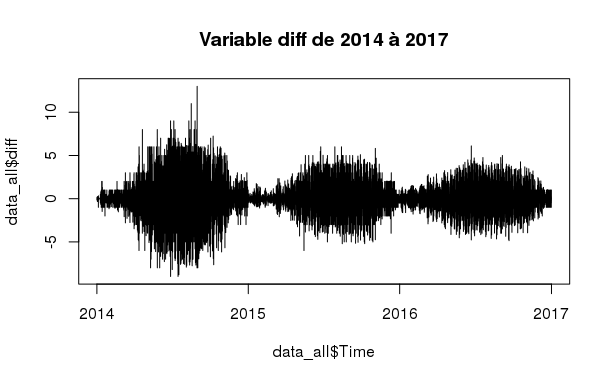

# I- Introduction

### But et intérêts de l'étude

Dans le cadre du projet, nous avons construit un package R.
```{r warning=FALSE}
library("DivvyBikeProject")
```
Nous présenterons les fonctions présentes dans notre package au fur et à mesure du rapport.

### Remerciements

# II - Présentation des données

### Le jeu de données

Divvy est le système de partage de vélos de la ville de Chicago, avec $6000$ vélos disponibles à plus de $570$ stations à travers Chicago et Evanston. Divvy, comme les autres systèmes de vélos de libre-service, se compose d'une flotte de vélos robustes et durant qui sont enfermés dans un réseau de stations d'accueil dans toute la région. Les vélos peuvent être déverrouillés à partir d'une station et renvoyés à n'importe quelle autre station du système. Divvy offre aux résidents et aux visiteurs une option de transport pratique pour se déplacer et explorer Chicago.

Divvy est un programme du Département des Transports de Chicago (CDOT), qui possède les vélos, les stations et les véhicules de la ville. Le financement initial du programme provenait de subventions fédérales pour des projets qui favorisent le redressement économique, réduisent la congestion du trafic et améliorent la qualité de l'air, ainsi que des fonds supplémentaires provenant du programme de financement des augmentations d'impôt de la Ville. En 2016, Divvy s'est étendu à la banlieue voisine d'Evanston grâce à une subvention de l'État de l'Illinois.

Sur le site de Divvy, les [données](https://www.divvybikes.com/system-data) sur les trajets et les stations sont disponibles au public. Tous les ans, deux jeux de données sont publiés : un premier allant de janvier à juillet et un second allant de août à décembre.

Chaque trajet à vélo est anonymisé et comprend :

* Jour et heure du début du voyage

* Fin du voyage jour et heure

* Station de départ

* Station d'arrivée 

* Type de coureur (membre, tour unique et passe d'exploration)

* Si un membre voyage, il inclura également le sexe et l'année de naissance du membre

Exemple de 5 trajets réalisés en 2014 :

```{r warning=FALSE, echo=FALSE}
setwd("~/Documents/Camille/Data Mining/Rapport")
load("Trips_14.RData")
trips_pres
```

Les 5 premières lignes de la table des stations de 2014 :

```{r warning=FALSE, echo=FALSE}
load("Stations_14.RData")
station_pres
```

### Analyses descriptives des données

 Année      Stations      Trajets      
-------    ----------    ----------    
  2013        300           759 788          
  2014        300         2 454 634         
  2015        474         3 183 439        
  2016        581         3 595 383
  2017        585         3 829 014   
                         Total : 13 822 258
  
Table:  Nombre de trajets et stations par année.

Les vélos ont été mis en service en juin 2013 d'où un nombre de trajets plus faible. Ces chiffres nous montre une augmentation du nombre de trajets sur le réseau et une augmentation du réseau lieu même au cours du temps. C'est entre 2014 et 2015 que ces augmentations sont les plus importantes avec environ 30% de trajets supplémentaires et 174 nouvelles stations.

### Visualisation géographique

Pour visualiser l'emplacement des stations à Chicago, nous les avons tracés sur un fond de carte de la ville.


Les stations vélos ont d'abord été réparti au centre de la ville avant de s'étendre vers la banlieu.

### Autres représentations


Si on regarde la fréquentation des stations en 2016, on voit que les vélos les plus utilisés sont ceux du centre ville. 

**Rajouter changement dans les stations.**

# III - Transformation des données

Nous présenterons dans cette partie les manipulations que nous avons effectué sur les données. Cette partie est centrale puisqu'elle a nécessité beaucoup de travail et de temps.

Les données que l'on trouve sur le site de Divvy sont divisées par semestre. Les 9 fichiers de données ne sont pas homogènes. Les variables changent parfois de nom et le format des données n'est pas toujours le même. Pour unifier nos données et pouvoir les regrouper, nous avons mis a disposition dans notre package la fonction *BuildDataSet.R*.

```
BuildDataSet(year, raw_data, districts, Stations, save_data = FALSE)
```

**Vérifier avec Rémy**

Notre jeu de données vit en grande dimension (plus de13 millions de trajets et une dizaine de variables). Pour disposer de la capacité nécessaire à faire tourner les modèles, nous avons réduit la dimension en réalisant plusieurs agrégations. 

### Agrégation géographie/temps

Nous avons réalisé deux agrégations pour réduire la dimension de notre jeu de données. La première est temporelle : nos données sont agrégées par heure; et la seconde est spatiale puisque nous avons choisi de regrouper les stations par district. Chicago est divisé en **Demander à Rémy** districts.

Nous avons choisi la séparation en districts pour se calquer sur la statistique américaine (voir site Census). Bien que nous n'avons pas ajouté de variables sociales, il est tout à fait possible de le faire avec notre package. On peut voir le découpement de la ville en district sur les deux derniers graphiques.

**Rajouter les fonctions du package + nom du package qui nous a permis de faire la séparation spatiale.**

### Définition de notre série d'intérêt

Nous nous sommes intéressés à trois séries temporelles. Les deux premières sont les séries d'entrée et de sortie de vélos. La troisième est un combinaison linéaire des deux premières: c'est le différentiel entre les vélos rentrant et les vélos sortant nommé *diff*.

**Mettre graphiques des trois séries.**




### Ajouts de variables explicatives

Nous avons rajouté $4$ variables explicatives à notre jeu de données :

* La pluviométrie et la température trouvées dans le package R *Météo*.

* Les 12 jours fériés de l'Illinois.

* La variable "Day of Week" (*dow*) qui varie de 1 à 8 : lundi = 1, ..., vendredi = 7 et 8 pour les jours fériés.

Voici un extrait de nos données finales :
```{r warning=FALSE, echo=FALSE}
load("~/Documents/Camille/Data Mining/FullData2015.RData")
head(Data, 5)
```

### Quelques visualisations 

# IV - Les modèles 

### Tendance / Saisonalité
### Modèle GAM (GAMLSS) - significativité des variables
### Random Forests (Adaboost)
### Modèles auto-régressifs
### Agrégation  

# V - Conclusion
