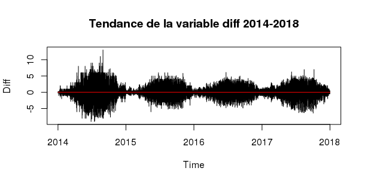

---
title: <p style="text-align:center";>Divvy Bike Project</p>
author: <p style="text-align:center";>Rémy Garnier - Camille Palmier</p>
date: <p style="text-align:center";>28 février 2018</p>
output:
  html_document: default
  pdf_document: default
---  

<p>&nbsp; </p>

# I- Introduction

### But et intérêts de l'étude

Dans le cadre du projet, nous avons construit un package R.
```{r warning=FALSE}
library("DivvyBikeProject")
```
Nous présenterons les fonctions présentes dans notre package au fur et à mesure du rapport.

### Remerciements

# II - Présentation des données

### Le jeu de données

Divvy est le système de partage de vélos de la ville de Chicago, avec 6 000 vélos disponibles à plus de 570 stations à travers Chicago et Evanston. Divvy, comme les autres systèmes de vélos de libre-service, se compose d'une flotte de vélos qui sont enfermés dans un réseau de stations d'accueil dans toute la région. Les vélos peuvent être déverrouillés à partir d'une station et renvoyés à n'importe quelle autre station du système. Divvy offre aux résidents et aux visiteurs une option de transport pratique pour se déplacer et explorer Chicago.

Divvy est un programme du Département des Transports de Chicago (CDOT), qui possède les vélos, les stations et les véhicules de la ville. Le financement initial du programme provenait de subventions fédérales pour des projets qui favorisent le redressement économique, réduisent la congestion du trafic et améliorent la qualité de l'air, ainsi que des fonds supplémentaires provenant du programme de financement des augmentations d'impôt de la Ville. En 2016, Divvy s'est étendu à la banlieue voisine d'Evanston grâce à une subvention de l'État de l'Illinois.

Sur le site de Divvy, les [données](https://www.divvybikes.com/system-data) sur les trajets et les stations sont disponibles au public. Tous les ans, deux jeux de données sont publiés : un premier allant de janvier à juillet et un second allant de août à décembre.

Chaque trajet à vélo est anonymisé et comprend :

* Jour et heure du début du voyage

* Fin du voyage jour et heure

* Station de départ

* Station d'arrivée 

* Type d'utilisateur (membre, tour unique ou passe d'exploration)

* Si un membre voyage, le sexe et l'année de naissance du membre seront inclus

Exemple de 5 trajets réalisés en 2014 :

```{r warning=FALSE, echo=FALSE}
setwd("~/StatML/Projet/ProjetDataMining/Rapport/")
load("Trips_14.RData")
trips_pres
```

Les 5 premières lignes de la table des stations de 2014 :

```{r warning=FALSE, echo=FALSE}
load("Stations_14.RData")
station_pres
```

### Analyses descriptives des données

 Année      Stations      Trajets      
-------    ----------    ----------    
  2013        300           759 788          
  2014        300         2 454 634         
  2015        474         3 183 439        
  2016        581         3 595 383
  2017        585         3 829 014   
                         Total : 13 822 258
  
Table:  Nombre de trajets et stations par année.

Les vélos ont été mis en service en juin 2013 d'où un nombre de trajets plus faible. Ces chiffres nous montre une augmentation du nombre de trajets sur le réseau et une augmentation du réseau lieu même au cours du temps. C'est entre 2014 et 2015 que ces augmentations sont les plus importantes avec environ 30% de trajets supplémentaires et 174 nouvelles stations.

### Visualisation géographique

Pour visualiser l'emplacement des stations à Chicago, nous les avons tracés sur un fond de carte de la ville.


Les stations vélos ont d'abord été réparti au centre de la ville avant de s'étendre vers la banlieue. Le réseau en 2017 est sensiblement le même que le réseau de 2016 (seulement 4 stations de plus).

### Autres représentations


Si on regarde la fréquentation des stations en 2016, on remarque que les vélos les plus utilisés sont ceux du centre ville. Par ailleurs, il y a un fort écart entre les stations les moins utilisées (moins de 200 vélos empruntés par an) et les stations les plus utilisées (jusqu'à 92 000 vélos empruntés).

# III - Transformation des données

Nous présenterons dans cette partie les manipulations que nous avons effectué sur les données. Cette partie est centrale puisqu'elle a nécessité beaucoup de travail et de temps.

Les données que l'on trouve sur le site de Divvy sont divisées par semestre, ou par mois selon les années. Les données n'ont pas un format homogène. Les variables changent parfois de nom et le format des données n'est pas toujours le même. On a également été confronté à un problème au niveau des stations : elles peuvent changer de noms au cours du temps ou se déplacer de quelques mètres.

Notre jeu de données vit en grande dimension (plus de 13 millions de trajets et une dizaine de variables). Pour disposer de la capacité nécessaire pour faire tourner les modèles, nous avons réduit la dimension en réalisant plusieurs agrégations. 

### Agrégation temporelle

Nous avons compté, pour chaque station, le nombre de vélos entrant (nbE) et le nombre de vélos sortant (nbS) à chaque heure. Nous avons donc perdu l'information sur les trajets, puisque qu'on ne sait plus d'où vient chaque vélo. Par ailleurs, nous avons négligé les informations sur les utilisateurs. 

L'agrégation temporelle (ainsi que la standardisation du format des données) se fait en utilisant la fonction **aggregateData** du package.

### Agrégation spatiale

Le fait que de nouvelles stations s'ouvrent constamment, ainsi que le fait qu'elles sont parfois déplacées, nous a conduit à grouper les données géographiquement. Ainsi, nous supposons que des stations spatialement proche se comportent de la même façon. 

Pour gérer les données géographiques, nous nous avons utilisé les packages R *rgdal* et *raster*. Etant donné un découpage spatial de la ville de Chicago contenue dans le Large SpatialPolygonDataFrame *area*, ainsi qu'un fichier *data* regroupant les données agrégées temporellement sur les *stations*, on obtient une agrégation spatiale via la fonction **groupByGeospatialData(data, area, stations, year,  save_data = FALSE)**
   
Pour nos tests, nous avons choisi le découpage géographique par circonscriptions législatives pour la chambre basse de l'Illinois, obtenue sur le site du [recensement](https://www.census.gov/) américain. Ce découpage n'est objectivement pas très bon, notamment à cause de la pratique du [gerrymandering](https://fr.wikipedia.org/wiki/Gerrymandering). En effet, la forme des circonscriptions est généralement tortueuse (voir carte plus haut) et regroupe des populations différentes pour des considérations électorales. Cependant, il s'agissait du seul regroupement à la bonne échelle que nous avons pu trouver. Par ailleurs, comme on le verra, ce découpage est déjà assez informatif. 

On peut ainsi regrouper les stations dans une vingtaine de regions géographiques différentes qui comportent chacune en moyenne 24 stations (avec un écart type de 18).

### Ajouts de variables explicatives

Nous avons rajouté $3$ variables explicatives à notre jeu de données :

* La pluviométrie (*pluvio*) et la température (*temp*) grâce au package *riem*.

* La variable "Day of Week" (*dow*) qui varie de 1 à 8 : lundi = 1, ..., vendredi = 7 et 8 pour les jours fériés.

Ces variables sont ajoutés respectivement par les fonctions **getMeteo** et **getSpecialDays**.

L'ensembles des manipulations décrites dans les trois derniers paragraphes ont été regroupées dans la fonction **BuildDataSet**.

Voici un extrait de nos données finales :
```{r warning=FALSE, echo=FALSE}
load("~/StatML/Projet/ProjetDataMining/FullData2015.RData")
Data[55:60,]
```


### Définition de nos séries d'intérêt

Nous avons proposé $3$ série d'interet différentes par région:

 * **nbEstat** : le nombre moyen de vélos par station entrant dans la région à une heure donnée par
 
 * **nbSstat** : le nombre moyen de vélos par station sortant de la région à chaquye
 
 * **diff** = nbEstat - nbStat : la différence entre le nombre de vélos entrant et sortant de chaque région par heure et par station
 
Nous estimons que cette dernière statistique est la plus utile, car elle peut servir à l'entreprise pour determiner comment elle doit déplacer les vélos entre les différentes régions afin de s'assurer que les stations ne soient jamais complètement vides ou complètement pleines. 


Ce premier graphique permet de visualisation la variable représentant la différence entre le nombre de vélos entrant et le nombre de vélos sortant. La forme générale est la même : les vélos sont moins empruntés en début d'année (période hivernale - janvier/février). C'est en été que la différence entrant/sortant est la plus importante. 

Pour bien comprendre la forme de la série, intéressons nous à des séries *nbEstat* et *nbSstat* sur une période de temps restreinte et sur une seule station (la station 9) : soit la deuxième semaine du mois de *juillet 2014*.

Pour réaliser ces graphiques, nous avons utilisé le district 9 qui se trouve en plein centre ville. C'est également le district qui comporte le plus de stations.


On voit en semaine deux grands pics : un premier le matin et un second en fin d'après-midi (voir graphique suivant). Ces pics correspondent aux trajets pour aller et pour revenir du travail. Certaines personnes utilisent également les vélos lors de la pause déjeuner d'où un troisième pic entre les deux plus grands.

Le profil des week-ed est différent, on observe plus le même rythme au niveau du matin et du soir : les vélos sont plutôt utilisés pour se promener dans la ville. 

Le choix de la station 9 a une influence sur les semaines. En effet, dans les districts du centre de Chicago, on peut voir que le nombre d'entrée et le nombre de sortie est quasiment similaire au cours de la journée. Cela est surement dû au fait que les personnes au coeur de la ville se déplacent entre ces grands districts et que les personnes vivant un peu plus loin du centre viennent le matin travailler.

Pour comprendre le contraste entre les districts de banlieu et les distrits du centre, le graphique suivant montre la même semaine de juillet 2014 mais pour le district 4.


On peut voir que les personnes partent au travail le matin et rentrent le soir. Les interactions avec les autres districts sont plus faibles.

Pour finir avec les visualisations, voici le profil d'une journée de semaine type :


Le premier pic est localisé dans les environs de 7h du matin et le second vers 17h. 

### Quelques visualisations 

# IV - Les modèles 

### Tendance / Saisonalité

Par construction, la variable **diff** au cours du temps est centré en zéro. Il n'y a pas de tendance, comme le montre le graphique ci-dessous. 



Pour tracer ce graphique, nous avons utilisé le modèle linéaire suivant :

```{r echo=FALSE}
load("~/StatML/Projet/ProjetDataMining/FullData2014.RData")
data_2014 <- Data
load("~/StatML/Projet/ProjetDataMining/FullData2015.RData")
data_2015 <- Data
load("~/StatML/Projet/ProjetDataMining/FullData2016.RData")
data_2016 <- Data
load("~/StatML/Projet/ProjetDataMining/FullData2017.RData")
data_2017 <- Data
rm(Data)
data_all <- rbind(data_2014,data_2015,data_2016,data_2017)
rm(data_2014,data_2015,data_2016, data_2017)
```

```{r echo=TRUE}
lm0 <- lm(diff~Time, data=data_all)
lm0$coefficients
```

Les coefficients de la droite sont bien très proches de zéro.

### Modèle GAM (GAMLSS) - significativité des variables
### Random Forests (Adaboost)

# V - Conclusion
