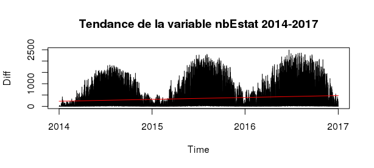
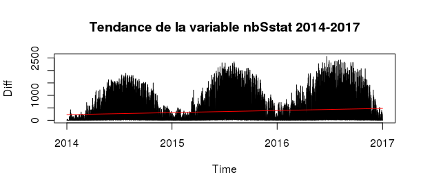
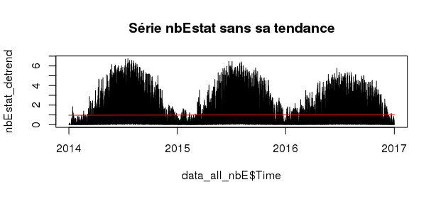

---
title: <p style="text-align:center";>Divvy Bike Project</p>
author: <p style="text-align:center";>Rémy Garnier - Camille Palmier</p>
date: <p style="text-align:center";>9 mars 2018</p>
output:
  html_document: default
  pdf_document: default
---  

<p>&nbsp; </p>

# I- Introduction

Dans le cadre du cours *Data Mining*, nous avons choisi des données temporelles sur le système de partage de vélos de la ville de Chicago. Le but de ce projet est de manipuler des données en grande dimension (nous avons récupéré environ 13 millions de données) et de construire des modèles de prédiction performants. 

Notre rapport s'organise de la manière suivante : nous présentons dans une première partie les données brutes puis dans une seconde les données transformées. En effet, un enjeu important a été de transformer les données dans un format compatible avec nos envies de prédiction et nos modèles. Une troisième partie portera sur les modèles que nous avons utilisé pour la prédiction. Dans cette dernière partie, nous parlerons du découpage Tendance/Saisonnalité de nos séries, des modèles additifs généralisés (*gam*) et des modèles d'arbre (*Random Forest*).

Dans le cadre du projet, nous avons construit un package R :
```{r warning=FALSE}
library("DivvyBikeProject")
```

La fonction de ce package est de regrouper toutes les manipulations que nous avons apportées sur les données : il permet donc de passer des données brutes (directement téléchargeables sur Internet, voir **II**) aux différents jeux de données utilisés dans nos modèles. Nous présenterons les fonctions présentes dans notre package au fur et à mesure des deux premières parties.

# II - Présentation des données

### Le jeu de données

Divvy est le système de partage de vélos de la ville de Chicago, avec 6 000 vélos disponibles à plus de 570 stations à travers Chicago et Evanston. Divvy, comme les autres systèmes de vélos de libre-service, se compose d'une flotte de vélos qui sont enfermés dans un réseau de stations d'accueil dans toute la région. Les vélos peuvent être déverrouillés à partir d'une station et renvoyés à n'importe quelle autre station du système. Divvy offre aux résidents et aux visiteurs une option de transport pratique pour se déplacer et explorer Chicago.

Divvy est un programme du Département des Transports de Chicago (CDOT), qui possède les vélos, les stations et les véhicules de la ville. Le financement initial du programme provenait de subventions fédérales pour des projets qui favorisent le redressement économique, réduisent la congestion du trafic et améliorent la qualité de l'air, ainsi que des fonds supplémentaires provenant du programme de financement des augmentations d'impôt de la ville. En 2016, Divvy s'est étendu à la banlieue voisine d'Evanston grâce à une subvention de l'État de l'Illinois.

Sur le site de Divvy, les [données](https://www.divvybikes.com/system-data) sur les trajets et les stations sont disponibles au public. Tous les ans, deux jeux de données sont publiés : un premier allant de janvier à juin et un second allant de juillet à décembre.

Chaque trajet à vélo est anonymisé et comprend :

* Jour et heure du début du voyage

* Jour et heure de la fin du voyage

* Station de départ

* Station d'arrivée 

* Type d'utilisateur (membre, tour unique ou passe d'exploration)

* Si un membre voyage, le sexe et l'année de naissance sont inclus

Exemple de 5 trajets réalisés en 2014 :

```{r warning=FALSE, echo=FALSE}
setwd("~/StatML/Projet/ProjetDataMining/Rapport/")
load("Trips_14.RData")
trips_pres
```

En plus des deux fichiers sur les trajets à vélo, nous pouvons récupérer tous les ans une table sur les stations. Pour chaque station, nous avons :

* Identifiant

* Nom 

* Latitude

* Longitude

* Capacité (nombre de vélos que la station peut supporter)

* Date de mise en service

Les 5 premières lignes de la table des stations de 2014 :

```{r warning=FALSE, echo=FALSE}
load("Stations_14.RData")
station_pres
```

### Analyses descriptives des données

 Année      Stations      Trajets      
-------    ----------    ----------    
  2013        300           759 788          
  2014        300         2 454 634         
  2015        474         3 183 439        
  2016        581         3 595 383
  2017        585         3 829 014   
                         Total : 13 822 258
  
Table:  Nombre de trajets et stations par année.

Les vélos ont été mis en service en juin 2013 d'où un nombre de trajets plus faible. Ces chiffres nous montrent une augmentation du nombre de trajets sur le réseau et une augmentation de la taille du réseau lui-même au cours du temps. C'est entre 2014 et 2015 que ces augmentations sont les plus importantes avec environ 30% de trajets supplémentaires et 174 nouvelles stations.

L'extention du service à la banlieue d'Evanston en 2016 représente la création de quatre nouvelles bornes dans le réseau.

### Visualisation géographique

Grâce aux informations présentes dans la table *Station*, nous pouvons visualiser l'emplacement des stations vélos dans la ville de Chicago.


Sur ce graphique, nous n'avons pas rajouté les stations de 2013 et de 2017 car il y a peu de changements entre 2013 et 2014 et entre 2016 et 2017.

Nous pouvons voir que les stations-vélo ont dans un premier temps été réparties dans le centre puis elles vont ensuite s'étendre vers les banlieues.

Nous nous sommes également rendus compte que certaines stations se déplaçaient de quelques mètres d'une année sur l'autre ou changaient de nom. Ces deux observations font partie des raisons justifiant l'agrégation spatiale faite par la suite.

Regardons maintenant la fréquentation des stations en 2016 : 


Nous remarquons sur ce graphique, que les stations-vélos les plus utilisées sont surtout celles du centre-ville, ce qui peut s'expliquer par exemple par une densité plus forte. 

Nous pouvons voir qu'il y a un fort écart entre les stations les moins utilisées (moins de 200 vélos empruntés par an) et les stations les plus utilisées (jusqu'à 92 000 vélos empruntés par an).

# III - Transformation des données

Nous présenterons dans cette partie les manipulations que nous avons effectuées sur les données. Cette partie représente une bonne partie de notre travail et est donc centrale. Les remarques suivantes permettent de se rendre compte d'une partie des problèmes "simples" que nous avons rencontrés ayant motivés une transformation des données. 

Le format des données est variable au cours des ans. Les noms des différents champs, le découpage temporel, l'organisation des fichiers et le format des dates changent souvent. Par ailleurs, la position des stations ainsi que leurs noms peuvent changer d'une année sur l'autre.

<p>&nbsp; </p>

Nous avons réalisé plusieurs agrégations : une agrégation temporelle et une agrégation spatiale. Ces agrégations ont été motivées d'une part par les problèmes précédemment décrits et d'autre part par une volonté de réduire la dimension de notre jeu de données (13.5 millions de trajets et une dizaine de variables).

### Agrégation temporelle

Nous avons compté pour chaque station le nombre de vélos entrants (**nbE**) et le nombre de vélos sortants (**nbS**) à chaque heure. L'agrégation au pas horaire nous a paru pertinente car elle permet de garder une maille temporelle assez fine tout en réduisant la dimensionalité de manière efficace. 

Ce choix d'agrégation a conditionné nos séries d'intérêt puisque nous avons perdu des informations telles que les informations sur les utilisateurs ou encore le détail précis de chaque trajet.

L'agrégation temporelle (ainsi que la standardisation du format des données) se fait en utilisant la fonction **aggregateData** du package.

### Agrégation spatiale

Le fait que de nouvelles stations s'ouvrent constamment, ainsi que le fait qu'elles sont parfois déplacées, nous a conduit à grouper les données géographiquement. Ainsi, nous supposons que des stations spatialement proches se comportent de la même façon. 

Pour gérer les données géographiques, nous avons utilisé les packages R *rgdal* et *raster*. Étant donné un découpage spatial de la ville de Chicago contenu dans le Large SpatialPolygonDataFrame *area*, ainsi qu'un fichier *data* regroupant les données agrégées temporellement sur les *stations*, nous obtenons une agrégation spatiale via la fonction **groupByGeospatialData(data, area, stations, year,  save_data = FALSE)**
   
Pour nos tests, nous avons choisi le découpage géographique par circonscriptions législatives pour la chambre basse de l'Illinois, obtenu sur le site du [recensement](https://www.census.gov/) américain. Ce découpage n'est objectivement pas très bon, notamment à cause de la pratique du [gerrymandering](https://fr.wikipedia.org/wiki/Gerrymandering). En effet, la forme des circonscriptions est généralement tortueuse (voir carte plus haut) et regroupe des populations différentes pour des considérations électorales. Cependant, il s'agit du seul regroupement à la bonne échelle que nous avons pu trouver. Par ailleurs, comme on le verra, ce découpage est déjà informatif. 

On peut ainsi regrouper les stations dans une vingtaine de régions géographiques différentes qui comportent chacune en moyenne 24 stations (avec un écart type de 18).

### Ajouts de variables explicatives

Nous avons rajouté $3$ variables explicatives à notre jeu de données :

* La pluviométrie (*pluvio*) et la température (*temp*) grâce au package *riem*. Lorsque les données sont manquantes, on prend pour température la température moyenne mensuelle horaire constatée et on suppose qu'il n'y a pas de précipitation. 

* La variable "Day of Week" (*dow*) qui varie de 1 à 8 : lundi = 1, ..., dimanche = 7 et 8 pour les jours fériés.

Ces variables sont ajoutées respectivement par les fonctions **getMeteo** et **getSpecialDays**.

L'ensemble des manipulations décrites dans les trois derniers paragraphes ont été regroupées dans la fonction **BuildDataSet**.

Voici un extrait de nos données finales :
```{r warning=FALSE, echo=FALSE}
load("~/StatML/Projet/ProjetDataMining/FullData2015.RData")
Data[55:60,]
```


### Définition de nos séries d'intérêt

Nous avons proposé $3$ séries d'intérêt différentes :

 * **nbEstat** : le nombre moyen de vélos par station entrant dans la région à une heure donnée par district
 
 * **nbSstat** : le nombre moyen de vélos par station sortant de la région à une heure donnée par district
 
 * **diff** = nbEstat - nbStat : la différence entre le nombre de vélos entrant et sortant de chaque région par heure et par district
 
Nous estimons que cette dernière statistique est la plus utile, car elle permet de déterminer comment les vélos doivent être déplacés entre les différentes régions afin de s'assurer que les stations ne soient jamais soit complètement vides, soit complètement pleines. 


Ce premier graphique permet de visualiser la variable **diff**. La forme générale est la même quelque soit l'année : les vélos sont moins empruntés en début d'année (période hivernale - janvier/février) et c'est en été que la différence entrant/sortant est la plus importante. 

Pour bien comprendre la forme de la série, intéressons-nous à *nbEstat* et *nbSstat* sur une période de temps restreinte (la deuxième semaine du mois de *juillet 2014*) et sur une seule station (la station 9). Le district 9 se situe en plein centre ville et regroupe le plus de stations.


Nous pouvons voir qu'en semaine il y a deux grands pics : un premier le matin (au alentour de 7h) et un second en fin d'après-midi (au alentour de 18h, voir graphique sur le profil journalier). On peut supposer que ces pics correspondent aux trajets pour aller et pour revenir du travail/école. Certaines personnes utilisent également les vélos lors de la pause déjeuner d'où un troisième pic moins important le midi.

Le profil des week-end est différent, nous n'observons plus le même rythme au niveau du matin et du soir : les vélos sont plutôt utilisés pour se promener dans la ville de 10h à 18h. 

Le choix de la station 9 a une influence sur les semaines. En effet, dans les districts du centre de Chicago, on peut voir que le nombre d'entrée et le nombre de sortie est quasiment similaire au cours de la journée. Cela est surement dû au fait que les personnes au coeur de la ville se déplacent entre ces grands districts et que les personnes vivant un peu plus loin du centre viennent le matin travailler.

Pour comprendre le contraste entre les districts de banlieue et les distrits du centre, le graphique suivant montre la même semaine de juillet 2014 mais pour le district 4.


Nous pouvons supposer que les interactions avec les autres districts sont plus faibles.

Pour compléter la visualisation hebdomadaire, voici le profil d'une journée de semaine type :


# IV - Les modèles 

Nous utiliserons comme critère de perfomance le RMSE (écart-type moyen). Pour nbE_stat , la moyenne des performances est de 0.40 et l'écart type standard est de 0.96. Ces chiffres nous permettent de constater les perfomances des différents modèles que nous allons présenter. 

### Tendance 

Pour commencer, intéressons-nous à la tendance de nos séries. La série **diff** n'ayant pas de tendance par construction (centrée en zéro), nous allons nous concentrer sur les séries **nbEstat** et **nbSstat**. 

Pour ces deux séries, nous voyons un effet multiplicatif de la tendance et de la saisonnalité qui est traduit par l'équation suivante :

**Série = Tendance * Saisonnalité Annuelle * (Saisonnalité Quotidienne + écart ) **

Pour chercher la tendance, nous avons utilisé un modèle linéaire (fonction *lm*). La tendance est représentée par la droite rouge sur les deux graphiques suivants.





Que ce soit pour la variable **nbEstat** ou pour la variable **nbSstat**, la tendance est croissante. Nous avons vu précédemment qu'au fur et à mesure du temps, le nombre de vélos entrant ou sortant augmentait.

Les deux séries se ressemblant beaucoup, nous allons présenter uniquement les résultats pour la variable **nbEstat**.

Le graphique suivant montre la variable corrigée de sa tendance. La courbe rouge est là pour vérifier que nos données corrigées aient bien une tendance nulle.



### Saisonnalité

Les visualisations graphiques semblent nous indiquer une double saisonnalité : annuelle et journalière. Pour rechercher la saisonnalité nous avons utilisé la fonction *lm* comme précédemment pour la tendance mais également les modèles additifs généralisés (*gam*). Ces deux méthodes ont abouti au même résultat.

Nous avons commencé par la saisonnalité la plus globale, soit la saisonnalité annuelle qui est visible en rouge sur le graphique suivant :


En corrigeant la variable de sa saisonnalité annuelle (en plus de sa tendance), nous obtenons le résultat suivant :


### Modèle GAM 

#### Un premier modèle :

Une autre idée est d'utiliser les modèles GAM classiques afin de prédire les différentes variables d'intérêts. On procède de la façon suivante:

 * On utilise d'abord les données de 2014 et 2015 comme données d'entraînement, et on valide le choix d'hyper-paramètres en utilisant les données de 2016 comme ensemble de validation ; 

 * On utilise ensuite toutes les données de 2014 à 2016 pour prédire la variable en 2017.

Nous avons effectué quelques manipulations de donnée supplémentaires afin de mieux prédire :

 * Nous avons trié les districts par ordre de fréquentation, afin de pouvoir obtenir un comportement monotone ;
 
 * Par ailleurs, nous avons identifié les périodes les plus actives (de 7 à 8h et de 16 à 18h en semaine) par une variable spéciale.

Le modèle obtenu n'est pas très efficace, et on obtient un RMSE de 0.744.

#### Un second modèle :

En utilisant les mêmes hyper-paramètres que précedemment, on peut essayer de n'utiliser comme données d'entraînements que les données concernant un district donné pour prédire sur ce district. On appelle ce modèle modèle local, en opposition au modèle précédent, global. Le plus souvent, les modèles locaux sont plus efficaces pour prédire que le modèle global, mais ce n'est pas toujours le cas.  Le tableau suivant montre les résultats obtenus pour quelques districts (choisis pour leur représentativité) :

 District     Global         Local      
----------  ----------    ----------    
    2         0.39           0.13             
    9         1.00           0.79            
   12         1.92           1.18           
   14         0.31           0.34   

Table: RMSE pour différents districts pour les modèles locaux et globaux

On représente sur les graphiques suivant *nbEstat* (en rouge) ainsi que sa prédiction (en noir) entre le 4 et le 12 septembre 2017. On remarque que la prévision semble moins bonne pour le 4 septembre, qui est un jour férié. 


### Random Forests

Un modèle que nous avons utilisé est celui des random forests du package *Random Forests*. On utilise les données de 2014 à 2016 pour entraîner le modèle, et on calculera les erreurs sur les données de 2017. Ce modèle est assez simple à implémenter et obtient de très bons résultats. Cependant, il est un peu coûteux en temps de calcul. En utilisant 10 arbres, on obtient pour la prévision de *nbEstat* un RMSE  de *0.305*. 

Sur les graphiques suivants, on a représenté les résultats de ce modèle pour différents districts :


Les random forests nous permettent également d'étudier les influences des différentes variables. On peut ainsi supprimer certaines variables, et essayer de voir quelle est l'erreur sans ces variables.

  Modèle                         RMSE   
 ----------------------------   ------------       
  Complet                       0.305                    
  Sans Données géographiques    0.850                    
  Sans la température           0.487            
  Sans le type de jours         0.405
  Sans les différentes années   0.322
  Sans la pluviométrie          0.305
   
Table:  RMSE pour différents modèles

Il semble donc que la plupart des variables soient significatives, mais pas la pluviométrie. Notons au passage que le découpage géographique semble pertinent, puisque l'écart si l'on considère que toutes les stations se comportent de manière identiques est plus important.  

Là encore, on peut tester la différence entre modèles locaux et globaux. 

 District     Global         Local      
----------  ----------    ----------    
    2         0.10           0.08             
    9         0.53           0.34            
   12         0.73           0.52           
   14         0.14           0.13  
   
Table: RMSE pour différents districts pour les modèles locaux et globaux

Les modèles locaux sont là encore plus efficaces que le modèle global. Par ailleurs, ils prennent individuellement moins de temps à se calculer. Ce sont ces modèles qui semblent être les plus efficaces parmi les modèles étudiés. 

# V - Conclusion

blablabla

Nous remercions Monsieur Goude pour nous avoir aider à réaliser ce projet. 

