Prediction de la consommation electrique
========================================================
author: Camille Palmier & Arnaud Valladier
date: 16 mars 2017
autosize: true
font-family: 'Helvetica'

## Sommaire :

- Statistiques Descriptives
- Modeles de prediction 
- Conclusion et ouvertures


Nos donnees de consommation et tendance
========================================================


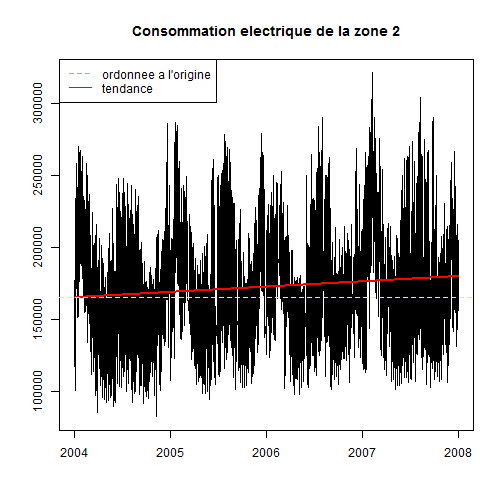

Saisonnalites
========================================================

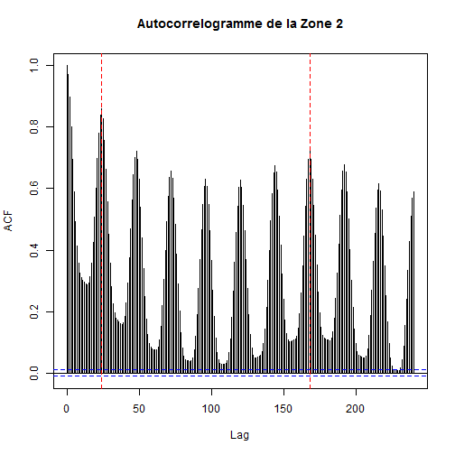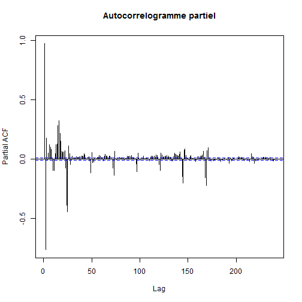

Annees
========================================================
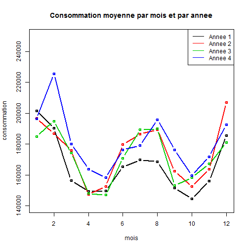

Consommation par mois
========================================================
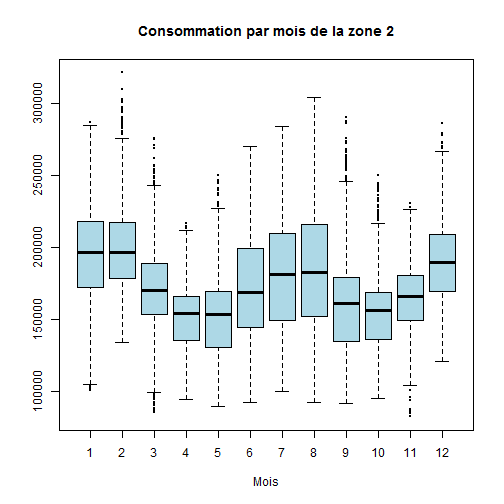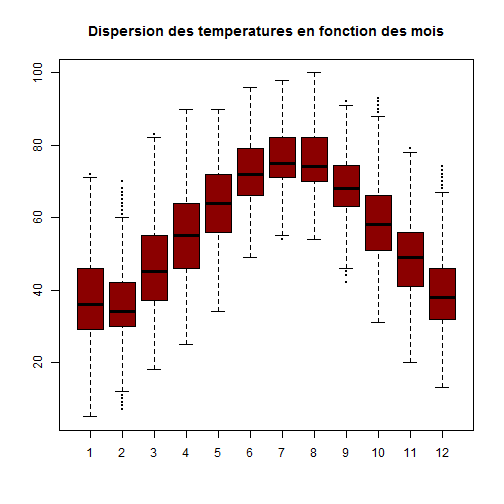

Consommation par heure 
========================================================
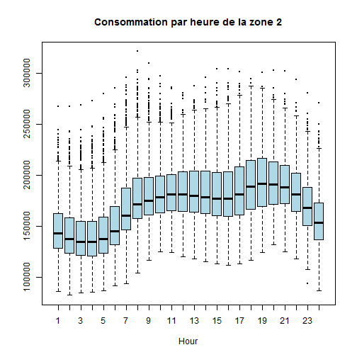

Consommation selon le type de jour
========================================================
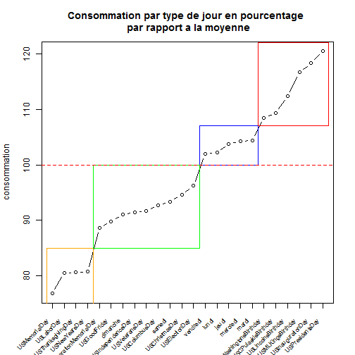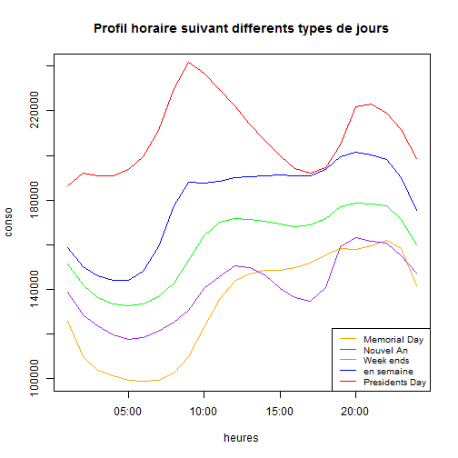

Consommation et temperatures
========================================================
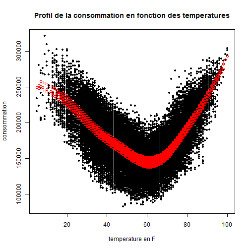


Modele de prediction - choix des stations
========================================================


```r
for(i in c(1:NStation)){
  for(j in c(1:i)){
    eq                   <- as.formula(paste("Zone2~Time+",Station[j,i],sep=""))
    reg.station          <- gam(eq, data=data0a)
    reg.forecast         <- predict(reg.station, data0b)
    R.squ[i,j]           <- summary(reg.station)$r.sq
    fit.err[i,j]         <- rmse(data0a$Zone2 - reg.station$fitted)
    forecast.err[i,j]    <- rmse(data0b$Zone2 - reg.forecast)
    fit.map[i,j]         <- mape(data0a$Zone2, reg.station$fitted )
    forecast.map[i,j]    <- mape(data0b$Zone2, reg.forecast)
  }
}
```

Modele de prediction - choix des stations
========================================================

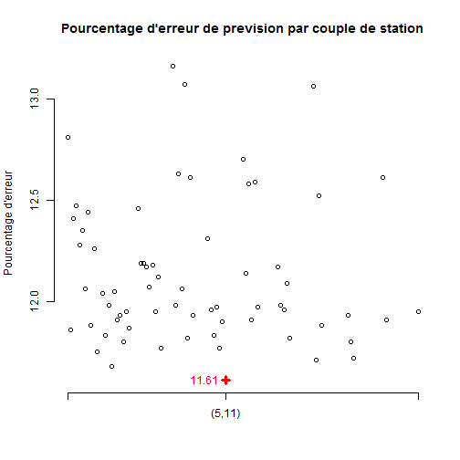


Modele de prediction - gam
========================================================


```r
eq <- as.formula(paste("Zone2~Time + s(Hour, by=daytype) + s(Toy,bs='cc')+",formule.gam.double, sep=""))
reg       <- gam(eq, data=data0a)
predict   <- predict(reg, data0b)

R              <- summary(reg)$r.sq                  #0.82  
fit.map        <- mape(data0a$Zone2, reg$fitted )    #6.94
forecast.map   <- mape(data0b$Zone2, predict)        #7.35  
```

Modele de prediction - gam
========================================================

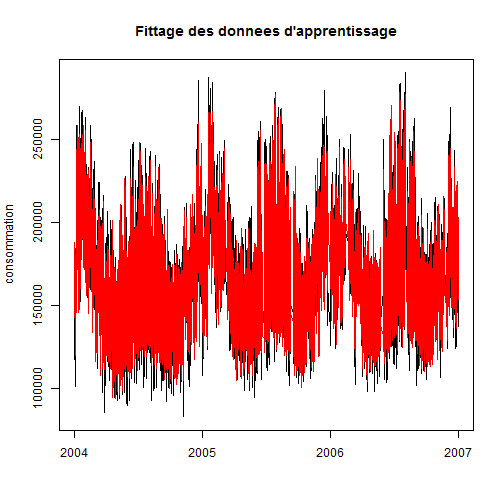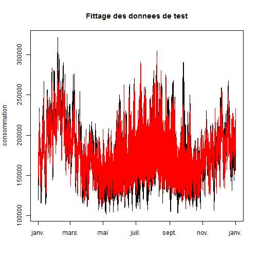

Residus du modele gam
========================================================
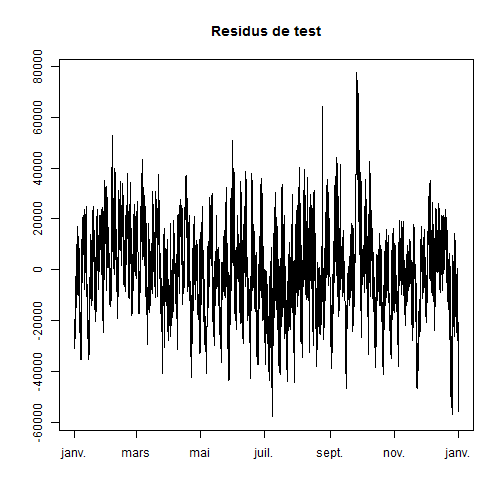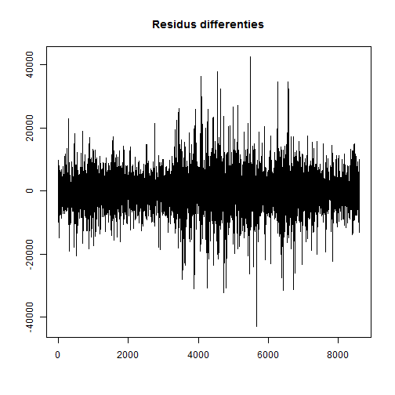

Etude des Residus - Modele SARIMA
========================================================

 

```r
for(i in 1:24){
  model.h[[i]] <- arima(res.h[,i], order = c(1,2,2), seasonal = list(order=c(4,0,4), period=7), method='CSS')}
```
Etude des Residus - Modele SARIMA
========================================================

```
$pred
Time Series:
Start = 8396 
End = 8402 
Frequency = 1 
[1]  -5507.177 -10513.466  -5524.448 -11771.784 -12633.611 -15976.618
[7]  -2396.663

$se
Time Series:
Start = 8396 
End = 8402 
Frequency = 1 
[1] 11434.84 14537.14 17555.25 19980.01 22187.62 24180.42 26026.53
```

Previsions sur l'annee 2008
========================================================

```
Zone2 ~ Time + s(Hour, by = daytype) + s(Toy, bs = "cc") + s(Station5, 
    k = 10, bs = "cr") + s(Station11, k = 10, bs = "cr")
```


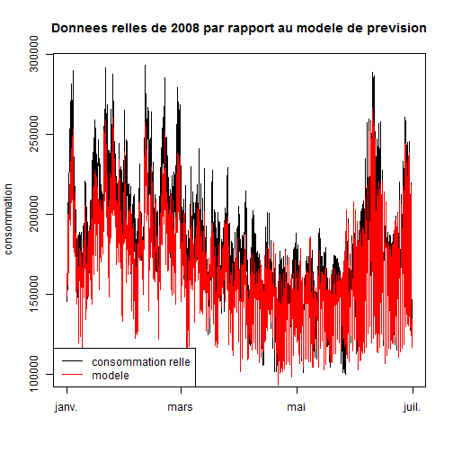

Previsions sur l'annee 2008
========================================================
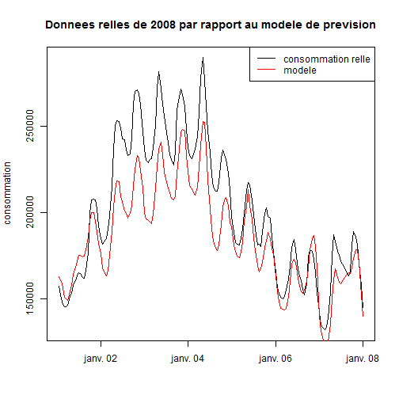

Conclusion et ouvertures
========================================================

- Script de prevision recursif
- Valeurs manquantes
- Methode de bootstrap pour quantifier l'erreur (intervalle de confiance)
- Integrer des variables explicatives (luminosite, l'humidite)


